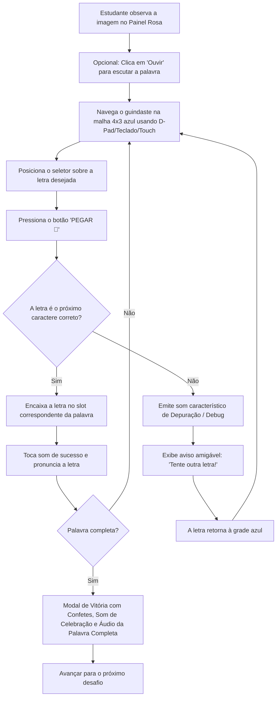

# Especificação Funcional e Técnica: Guindaste das Letras

> **Comando:** `/speckit-specify` & `/speckit-clarify`  
> **Aplicação:** Guindaste das Letras  
> **Público-Alvo:** Estudantes do 1º ano do Ensino Fundamental (Alfabetização + Pensamento Computacional)

---

## 🎯 Visão Geral do Sistema

O **Guindaste das Letras** é um jogo educacional interativo client-side projetado para trabalhar simultaneamente habilidades de alfabetização inicial e pensamento computacional. O estudante opera um guindaste em uma malha matricial para selecionar e transportar letras de uma grade embaralhada até a montagem da palavra indicada por uma imagem de referência.

---

## 📐 1. Layout da Tela e Componentes de Interface

### 1.1 Topo (Cabeçalho de Controle)
- **Título & Nível Ativo:** Exibe o nome do nível selecionado (ex: *Nível 1: Encontros Vocálicos* ou *Nível 2: Palavras Dissílabas*).
- **Botão "Guia BNCC":** Abre um modal explicativo sobre o alinhamento pedagógico (habilidades `EF01CO01`, `EF01CO02`, `EF01LP02`, `EF01LP08`).
- **Contador de Progresso:** Indicador no formato `Desafio X de Y` (ex: `0/7` ou `3/4`).

### 1.2 Área Central (Tríptico da Aplicação)

#### A. Painel Azul (Esquerda - Grade de Seleção 4x3)
- **Estrutura:** Malha quadriculada de 4 colunas x 3 linhas.
- **Conteúdo das Células:** Letras embaralhadas da palavra-alvo mais distratores pertinentes.
- **Lâmpada Decorativa de Dica:** Ícone visual interativo de apoio.
- **Seletor Magnético do Guindaste:**
  - Moldura destacada com cantoneiras vermelhas visíveis.
  - Posição dinâmica alinhada à célula ativa `(coluna, linha)`.

#### B. Guindaste Central (Animação Visual e Mecânica)
- **Braço Superior (Lança):** Estrutura horizontal amarela perfurada com estilo industrial infantil.
- **Torre Vertical:** Coluna amarela de suporte central.
- **Cabo de Aço Extensível:** Linha dinâmica conectando a lança superior ao seletor magnético, ajustando altura e posição horizontal conforme a célula selecionada.
- **Base / Caminhão:** Veículo laranja com rodas azuis e bloco de contrapeso.

#### C. Painel Rosa (Direita - Painel Modelo de Referência 4x3)
- **Ilustração Central:** Imagem SVG/Vetorial ou expressão representativa da palavra atual.
- **Botão "🔊 Ouvir":** Aciona síntese de voz (Web Speech API) pronunciando a palavra ou ditongo.
- **Slots da Palavra Alvo ("Palavra: [ ] [ ]"):** Caixas de encaixe onde as letras capturadas são fixadas sequencialmente.

### 1.3 Rodapé (Controles e Acessibilidade)

#### A. Barra de Navegação Pedagógica
- **Botão Menu (BNCC):** Modal com fundamentação pedagógica.
- **Botão Ajuda (💡 Dica Falada):** Reproduz a dica em áudio falado.
- **Botão Reiniciar:** Redefine o desafio atual limpando as letras capturadas.
- **Anterior / Próximo Desafio:** Navegação manual entre palavras do mesmo nível.
- **Seletor de Níveis:** Alternador direto entre *Nível 1 (Vocálicos)* e *Nível 2 (Dissílabas)*.

#### B. D-Pad Direcional
- Painel cinza responsivo com 4 setas direcionais.
- Área de toque mínima garantida de **44px x 44px** por botão para acessibilidade infantil.
- Suporte simultâneo ao teclado físico (Setas / `WASD`).

#### C. Botão de Ação Destacado
- Botão amplo com rótulo **"PEGAR 🧲"** para acionar a garra magnética e confirmar a seleção da letra.

---

## 🔄 2. Fluxo de Interação do Estudante

---

## 🔍 3. Esclarecimentos e Regras de Negócio Clarificadas (Clarify)

1. **Bordas da Grade 4x3:**
   - As coordenadas `coluna (0..3)` e `linha (0..2)` são estritas.
   - Qualquer comando que extrapole os limites da grade é bloqueado, emitindo um feedback sonoro sutil de colisão (frequência grave de 120Hz).
2. **Célula Vazia / Letra Já Capturada:**
   - Pressionar "PEGAR" em uma célula sem letra não altera o estado do jogo; apenas emite um som neutro de tentativa sem ação.
3. **Comportamento no Reset / Troca de Fase:**
   - Ao reiniciar a fase ou alternar de nível, o seletor magnético retorna automaticamente para a posição inicial `(0, 0)`.
   - A palavra em montagem é limpa e todas as letras retornam aos seus lugares na grade.
4. **Interatividade durante Áudio Sintético:**
   - A movimentação do guindaste e as ações na interface **não são bloqueadas** enquanto a síntese de voz fala.
   - Chamadas de áudio consecutivas executam `window.speechSynthesis.cancel()` imediatamente antes de iniciar uma nova fala para evitar sobreposição ou filas travadas.
5. **Responsividade em Dispositivos Móveis:**
   - Em smartphones (modo retrato e paisagem), as grades se adaptam fluidamente com `max-w-full` e `aspect-[4/3]`.
   - Os botões do D-Pad possuem dimensão de toque mínima de **44px x 44px** para conformidade com as diretrizes de acessibilidade WCAG.

---

## 📚 4. Conteúdo Pedagógico

### Nível 1: Encontros Vocálicos (Ditongos e Tritongos)
`EU`, `OI`, `UI`, `IA`, `AI`, `EI`, `EIA`

### Nível 2: Palavras Dissílabas Canônicas (CV-CV)
`PATO`, `BOLA`, `COLA`, `MOLA`

---

## ✅ 5. Critérios Objetivos de Aceite

- [x] **Limites de Grade:** Extrapolar a malha 4x3 dispara o som de colisão grave sem mover o seletor.
- [x] **Célula Vazia:** Tentar pegar uma letra em espaço vazio emite o som neutro.
- [x] **Reset:** Reiniciar o desafio coloca o seletor na célula (0,0) e limpa os slots.
- [x] **Áudio sem Bloqueio:** O usuário pode navegar livremente enquanto o sintetizador de voz fala.
- [x] **Acessibilidade Touch:** Os botões do D-Pad mantêm altura e largura mínima de 44px.
