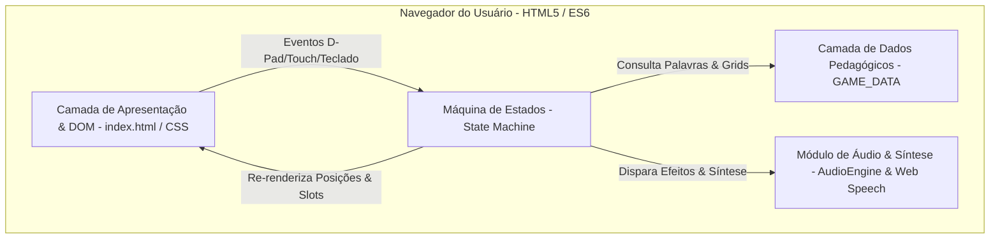

# Plano de Arquitetura e Engenharia: Guindaste das Letras

> **Comando:** `/speckit-plan`  
> **Status:** Aprovado / Pronto para Execução  
> **Plataforma:** Web Estática (GitHub Pages 100% Client-Side)

---

## 🏗️ 1. Arquitetura de Alto Nível

A arquitetura do **Guindaste das Letras** é estritamente client-side, modular e sem dependência de processos de build complexos (Webpack/Vite/Rollup). O sistema é organizado em quatro camadas desacopladas que se comunicam através de eventos e gerenciamento de estado previsível.



---

## 🧩 2. Separação Lógica dos Módulos

### 2.1 Camada de Dados (`js/data.js`)
- **Objeto Global:** `GAME_DATA`
- **Coleção `level1` (Encontros Vocálicos):** `EU`, `OI`, `UI`, `IA`, `AI`, `EI`, `EIA`.
- **Coleção `level2` (Palavras Dissílabas Canônicas):** `PATO`, `BOLA`, `COLA`, `MOLA`.
- **Propriedades por Desafio:**
  - `id`: identificador único.
  - `word`: palavra-alvo.
  - `label`: descrição textual do modelo visual.
  - `hint`: dica pedagógica contextually amigável.
  - `phoneme`: transcrição fonética simplificada.
  - `svg`: código SVG vetorial autossuficiente (sem dependência de assets `.png`/`.jpg`).
  - `gridLetters`: array de 12 caracteres dispostos na matriz 4x3.

### 2.2 Camada de Áudio & Síntese (`js/audio.js`)
- **Classe / Módulo:** `AudioEngine` (ou `AudioManager`)
- **Web Audio API (`AudioContext`):**
  - `playMoveSound()`: tom senoidal curto (440Hz ➔ 880Hz).
  - `playCollisionSound()`: tom de colisão nas bordas da matriz (120Hz grave).
  - `playEmptyGrabSound()`: tom neutro para clique em célula vazia.
  - `playGrabSound()`: tom de garra magnética em onda triangular.
  - `playSuccessSound()`: acorde maior sintetizado (C5-E5-G5).
  - `playDebugSound()`: tom dente de serra de depuração sem punição.
  - `playWinSound()`: arpejo festivo de celebração.
- **Web Speech API (`SpeechSynthesisUtterance`):**
  - Método `speak(text)` configurado para idioma `pt-BR` com taxa de reprodução de `0.95` (velocidade ideal para alfabetização).
  - Invoca `window.speechSynthesis.cancel()` previamente para evitar sobreposição ou filas travadas de áudio.

### 2.3 Camada da Máquina de Estados (`js/game.js`)
- **Estrutura do Estado Centralizado:**
  ```javascript
  const gameState = {
    currentLevelKey: 'level1', // 'level1' | 'level2'
    currentChallengeIndex: 0,
    cranePos: { x: 0, y: 0 },   // Coordenadas x (0..3) e y (0..2)
    carryingLetter: null,       // Letra capturada no braço do guindaste
    currentAssembledLetters: [],// Pilha de acertos da palavra atual
    isCompleted: false          // Flag de conclusão do desafio
  };
  ```
- **Regras de Transição de Estado:**
  - `moveCrane(dx, dy)`: valida limites `0 <= x <= 3` e `0 <= y <= 2`.
  - `grabLetter()`: valida se o caractere atual é a próxima letra da palavra-alvo.
  - `resetChallenge()`: restaura `cranePos` para `(0, 0)` e limpa `currentAssembledLetters`.

### 2.4 Camada de Apresentação e Eventos (`index.html`)
- **Estilização:** Tailwind CSS CDN + CSS nativo para cantoneiras magnéticas vermelhas (`.red-corner`), balanço do cabo e animações de depuração (`.animate-debug`).
- **Eventos:**
  - **Ponteiro:** `pointerdown` / `click` no D-Pad, células da grade e botões de ação.
  - **Teclado:** `ArrowUp`, `ArrowDown`, `ArrowLeft`, `ArrowRight`, `Space`, `Enter`, `WASD`.
  - **Acessibilidade:** Toque mínimo de **44px x 44px** em todos os controles móveis.

---

## 📂 3. Estrutura de Diretórios e Documentação

```
Guindaste/
├── .speckit/
│   ├── constitution.md   # Princípios permanentes do projeto
│   ├── spec.md           # Especificação funcional e refinamentos
│   └── plan.md           # Plano de arquitetura e módulos
├── docs/
│   ├── constitution.md
│   ├── spec.md
│   ├── plan.md
│   ├── tasks.md          # Lista de tarefas executáveis
│   └── checklist.md     # Critérios de verificação de qualidade
├── js/
│   ├── data.js           # Banco de dados pedagógico (GAME_DATA)
│   ├── audio.js          # Módulo de sintetizador e voz (AudioEngine)
│   └── game.js           # Máquina de estados e controladores DOM
├── CONSTITUTION.md       # Cópia raiz da constituição
├── SPECIFICATION.md      # Cópia raiz da especificação
├── PLAN.md               # Cópia raiz do plano de arquitetura
└── index.html            # Aplicação estática principal
```

---

## ⚡ 4. Diretrizes de Desempenho e Compatibilidade

1. **Zero Asset Quebrado:** SVG inline e sons sintetizados no navegador garantem resiliência total contra erros HTTP 404.
2. **Execução no GitHub Pages:** Basta enviar o código ao repositório git e ativar o GitHub Pages na raiz `/`.
3. **Dispositivos Móveis:** layout responsivo otimizado para celulares (retrato e paisagem), tablets e telas interativas escolares.
